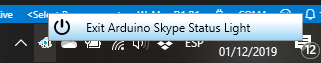

# DIY Arduino Skype for Business Status Light

This is a DIY project to use an arduino to show your skype status by using leds (and just in case... there are a lot of commercial options out-there (e.g. [Skype Light @ Amazon](https://www.amazon.com/Plenom-Busylight-UC-Alpha-Indicator/dp/B009ERB6WG/ref=sr_1_1?keywords=Plenom&qid=1575217790&sr=8-1)), but much funny to build your own and tune it).

## The Arduino Part

Get an [Arduino Nano](https://www.amazon.com/LAFVIN-Board-ATmega328P-Micro-Controller-Arduino/dp/B07G99NNXL/ref=sxin_2_ac_d_rm) and setup 3 [leds](https://www.amazon.com/Haobase-50pcs-Mixed-Colour-Wired/dp/B01DZIRPM4) - to match project arduino code, set the red on PIN 13, the yellow on PIN 12 and the green on PIN 11 (if you don't know how to start, check the basics [here](https://create.arduino.cc/projecthub/glowascii/led-blinkies-arduino-basics-9a1bbb?ref=tag&ref_id=beginner&offset=5)).
 Your arduino should end look similar to this:


Once setup, load [project provided arduino code](./src/Arduino/Arduino.ino) program into your arduino, and the hardware part is ready. Your arduino is waiting commands from the connected computer to light the Skype status led.

## Getting Skype for Business Status Light

### TLD;

If you want to get your Arduino Skype Status Light running, just go to project [Releases](https://github.com/NachoColl/arduino-skype-status-light/releases) and download/run ```Status.Skype.Arduinio.Nacho.Coll.exe```. Once you login to your Skype for Business account your arduino lights should display your status.

Please note that the .exe file is quite big, in order to simplify and be able to install/run on computers you can't install new software (your company computer). Also note that you may need to get dotnet core 3.x to run the application ([non-admin installation of the .NET Core SDK](https://docs.microsoft.com/en-us/dotnet/core/tools/dotnet-install-script)).

The application mainly runs in the background showing a small icon in your bar; To stop just click on it and press Exit:

.


